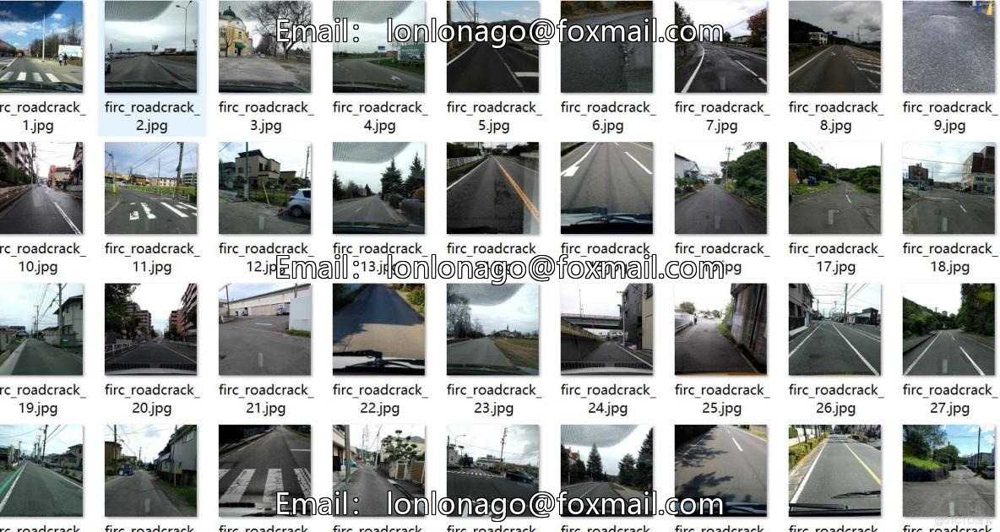
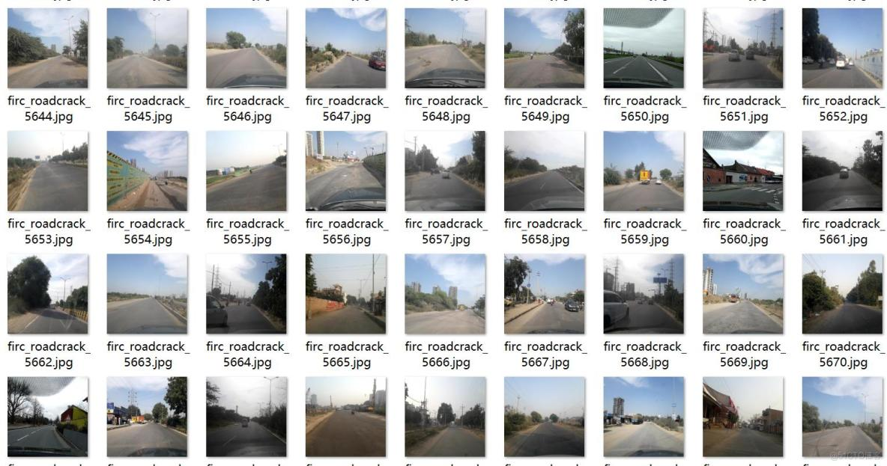
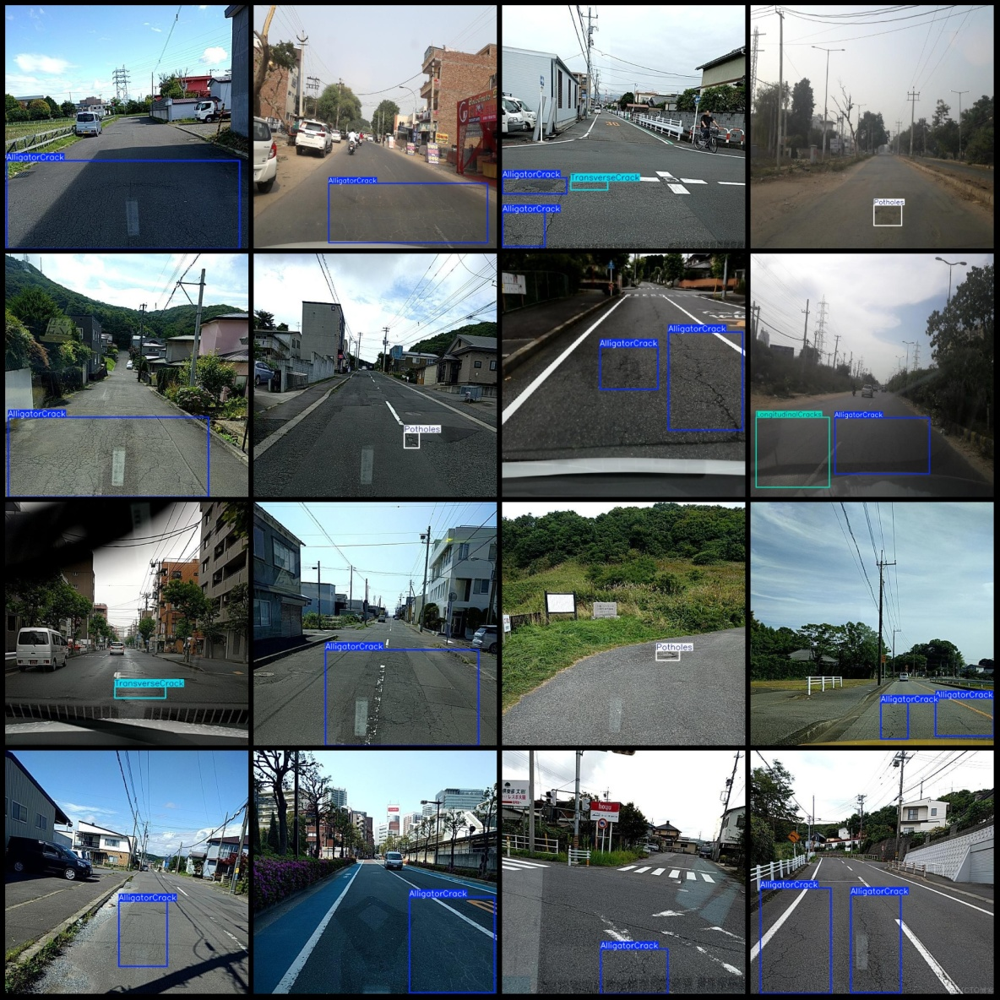
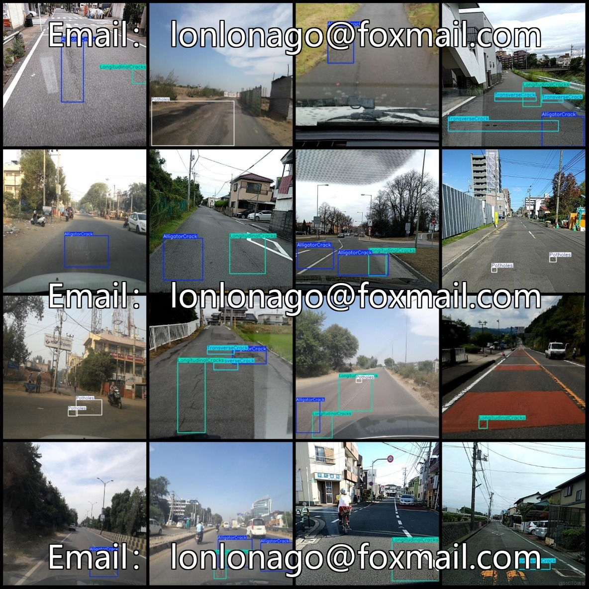

# Road Defect Dataset (VOC+YOLO) - 12,195 Images in 4 Categories

Dataset format: Pascal VOC format + YOLO format (excluding split paths in the txt file, only containing jpg images and corresponding VOC format xml files and yolo format txt files).
Number of images (jpg file count): 12,195
Number of annotations (xml file count): 12,195
Number of annotations (txt file count): 12,195
Number of categories: 4
Annotation category names (note that the yolo format category order does not correspond to this, but is based on the labels folder classes.txt): ["AlligatorCrack", "LongitudinalCracks", "Potholes", 
"TransverseCrack"]
Number of bounding boxes for each category:
- AlligatorCrack = 8381
- LongitudinalCracks = 6592
- Potholes = 5627
- TransverseCrack = 4446
Total bounding boxes: 25046
Number of images per category:
- AlligatorCrack = 6601
- LongitudinalCracks = 4670
- Potholes = 3074
- TransverseCrack = 2600
Image resolution: 600x600
Annotation tool used: labelImg
Annotation rules: Draw bounding boxes for categories
Important note: The dataset does not have a training/validation/test split; it requires manual division.
Special statement: This dataset does not guarantee any accuracy or precision for the models trained on it or the weight files.
Image previews:
## Images

Here is a pay link on Stripe ( https://buy.stripe.com/3cs8yP7sY87d0vu9AB ). Please contact me lonlonago@foxmail.com after funding $89, and I will send you a complete data files , thank you!

